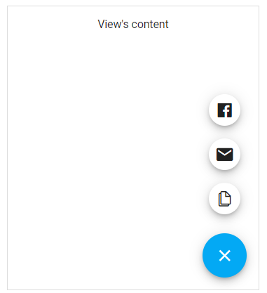

<!-- default badges list -->

<!-- default badges end -->
# DevExtreme Floating Action Button Multiple Actions - Getting Started 

This repository stores the code examples of the Floating Action Button component for the [Getting Started with Floating Action Button - Multiple Actions](https://js.devexpress.com/Documentation/Guide/UI_Components/Floating_Action_Button/Getting_Started_with_Floating_Action_Button/#Multiple_Actions_Speed_Dial) tutorial. The FAB allows users open a menu with several related actions (speed dial).

## Files to Review

- **Angular**
    - [app.component.html](angular/src/app/app.component.html)
    - [app.component.ts](angular/src/app/app.component.ts)
- **jQuery**
    - [index.js](jquery/index.js)
- **React**
    - [App.js](react/src/App.js)
- **Vue**
    - [App.vue](vue/src/App.vue)

## Documentation

- [Getting Started with Floating Action Button - Multiple Actions](https://js.devexpress.com/Documentation/Guide/UI_Components/Floating_Action_Button/Getting_Started_with_Floating_Action_Button/#Multiple_Actions_Speed_Dial)

- [Floating Action Button - API Reference](https://js.devexpress.com/Documentation/ApiReference/UI_Components/dxSpeedDialAction/)

<!-- feedback -->
## Does this example address your development requirements/objectives?

 

(you will be redirected to DevExpress.com to submit your response)
<!-- feedback end -->
